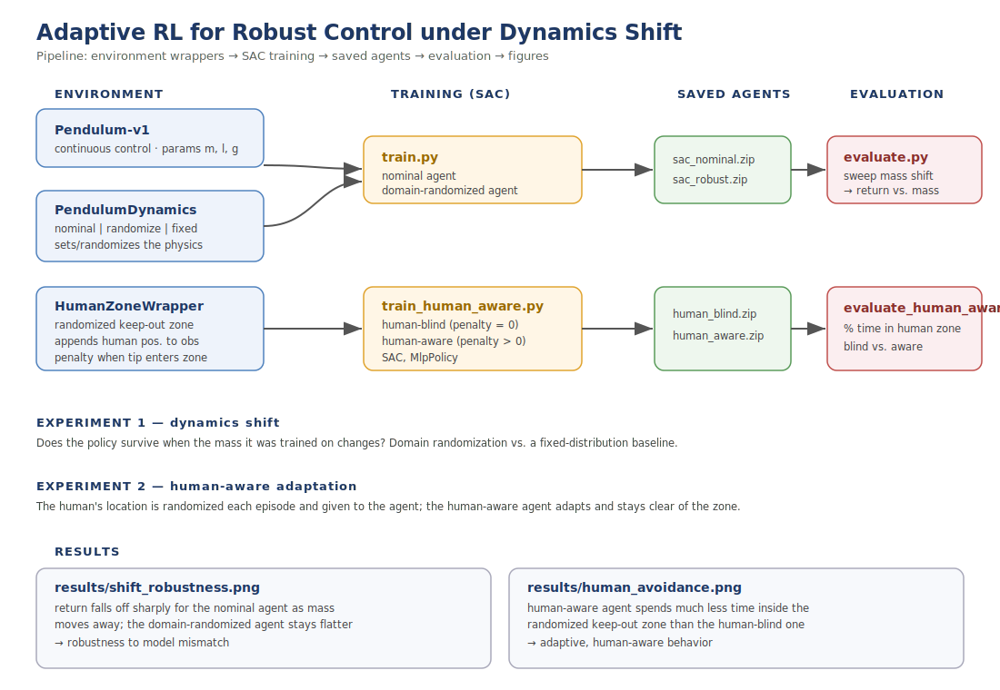
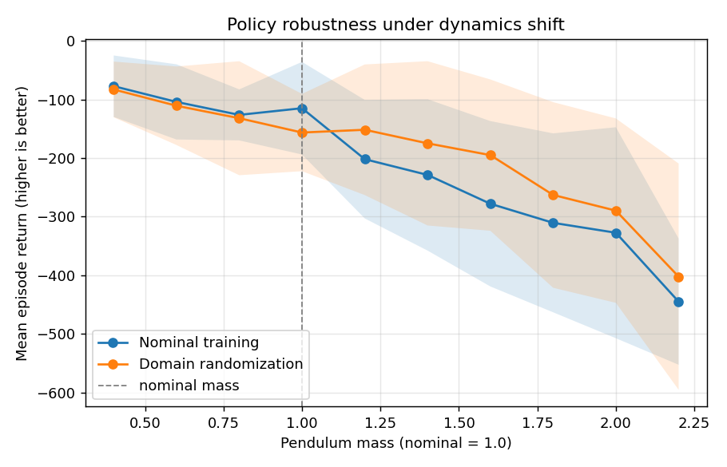
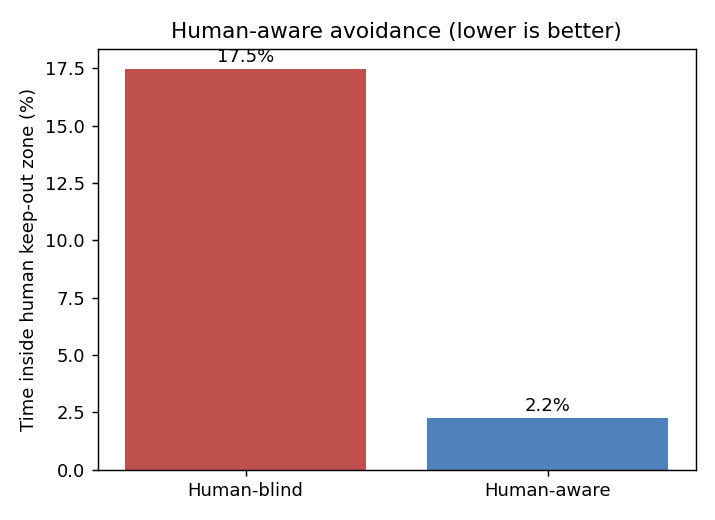

# adaptive-rl-robust-control

**Adaptive RL for robust control under dynamics shift**, with a human-aware avoidance experiment.

A small, focused study of a question at the heart of deploying learned policies on real robots: **what happens when the operating conditions change after training, and how do we keep the policy safe and effective?**

A standard reinforcement-learning agent often learns a policy that only works well on the exact dynamics it saw during training. This project demonstrates that failure mode on a classic control task and shows that **domain randomization** — training across a distribution of physical parameters — produces a policy that degrades far more gracefully when the dynamics shift (model mismatch).

## Pipeline





## Repository layout

```
src/envs.py                  # wrapper that sets/randomizes Pendulum physics
src/train.py                 # train SAC (nominal or domain-randomized)
src/evaluate.py              # sweep dynamics shift, plot robustness curves
src/human_aware.py           # randomized human keep-out zone (observed by agent)
src/train_human_aware.py     # train human-blind vs human-aware agents
src/evaluate_human_aware.py  # compare time spent in the human's zone
results/                     # output figures
```

## How to run

```bash
pip install -r requirements.txt

# Experiment 1 - train both agents
python src/train.py --mode nominal   --steps 60000 --out models/sac_nominal
python src/train.py --mode randomize --steps 60000 --out models/sac_robust

python src/evaluate.py --models models/sac_nominal models/sac_robust \
    --labels "Nominal training" "Domain randomization" \
    --out results/shift_robustness.png
```

## Experiment 1 - Robustness under dynamics shift

The pendulum mass is shifted away from the value the agents trained on. The nominal agent degrades sharply as the mass grows, while the domain-randomized agent stays more competitive — it generalizes to dynamics it was never trained on at that exact value.





## Experiment 2 - Human-aware adaptive behavior

A randomized angular keep-out zone is added near the upright goal, standing in for a human whose position changes every episode. The human's location is appended to the observation, so the agent can see where the human is and adapt. The human-aware agent spends far less time inside the zone than a human-blind baseline, while still solving the task.

```bash
python src/train_human_aware.py --penalty 0 --steps 80000 --out models/human_blind
python src/train_human_aware.py --penalty 5 --steps 80000 --out models/human_aware

python src/evaluate_human_aware.py --models models/human_blind models/human_aware \
    --labels "Human-blind" "Human-aware" \
    --out results/human_avoidance.png
```





## Design choices

- **SAC via Stable-Baselines3.** The RL algorithm is a well-tested library implementation; the contribution of this repo is the experimental study of robustness and adaptation, not a new optimizer.
- **Pendulum-v1.** A continuous-control benchmark with directly editable physical parameters (m, l, g), which makes the dynamics-shift experiment clean and fast to run on a laptop.

## Possible extensions

- Sweep length and gravity jointly, not just mass.
- Add online adaptation: estimate the current dynamics from recent transitions and condition the policy on that estimate.
- Replace model-free SAC with a small model-based agent that learns the dynamics and re-plans.
